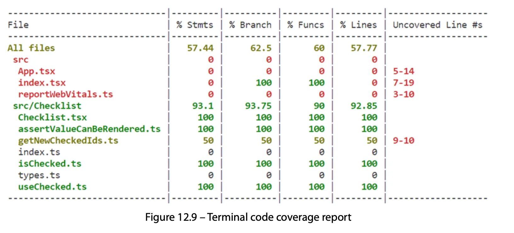

## **Learn React with Typescript**

A beginner’s guide to reactive web development with React 18 and TypeScript

**Carl Rippon**

## Summary

React builds an In-memory representation of the real DOM called `virtual DOM` , generating a new one and comparing with the current one to calculate the minimum required changes (only rendering the components that changed).

`StrictMode` component checks the content inside for potential problems

`Components` → JSX (mix of HTL and JS) needs to be transpiled into JS before it can be executed in a browser

`Props` can be passed into components, to control output and behavior, receiving them as an object.

`Event handler` functions → execute logic when the user interacts with the component.

`State` used to re-render a component and update its output, often updated in event handlers.

`TypeScript` adds type system to JS

A not null assertion (`!` after the variable) operator is a special operator in TS. It is used to inform the TypeScript compiler that the expression before it can’t be null or undefined.

`Webpack` is a tool that bundles JavaScript source code files together. It can also bundle CSS and images. It can run other tools such as Babel to transpile React and the TypeScript type checker as it scans the files.

## **Hooks**

`useEffect` Hook can be used to execute component side effects when it is rendered. Common case: fetch data

`useReducer` alternative to useState for using state, excellent for primitive state
values and for complex object state values, particularly when state changes depend on previous state values.

`useRef` creates a mutable value and doesn’t cause a re-render when changed. Can be used to set focus to an HTML element after it was rendered (automatic scroll?)

The `useMemo` and `useCallback` Hooks can be used to memoize values and functions, respectively, and can be used for performance optimization, but they don’t improve it necessarily.

## **Methods of styling**

With `plain CSS` all the styles in the imported CSS file are bundled regardless of whether a style is used. Styles are not scoped to a specific component – they could clash/collapse.

`CSS modules` are plain CSS files imported in a way that scopes styles to the component, pre-installed and pre-configured in projects created with Create React App. This resolved the CSS clashing problem but didn’t remove redundant styles.

`CSS-in-JS libraries` allow styles to be defined directly on the React component, emotion’s css prop, scoped like CSS modules but scoping happens at runtime rather than build time. The nice thing about this approach is that conditional-style logic can be implemented more quickly. There is an extra small performance cost of this approach because of the styles being created at runtime.

`Tailwind CSS` provides a set of reusable CSS classes that can be applied to React elements. Only the used Tailwind classes are included in the production build.

## **React Router**

`React Router` gives us a comprehensive set of components and hooks for managing the navigation between pages in our app.

 `createBrowserRouter` is used to define all our web app’s routes. A route contains a path and a component to render when the path matches the browser URL.

React Router’s `Outlet` component inside the App component to render page content.

`index route` on the root route can be used to render a welcome message.

We used React Router’s `NavLink` component to render navigation links that are highlighted when their route is active.

 `Link` component is great for other links that have static styling requirements.

`Route parameters` and `search parameters` allow parameters to be passed into components so that they can render dynamic content.

`useParams` gives access to route parameters, and `useSearchParam` provides access to search parameters.

React components can be `lazily loaded` to increase startup performance. This is achieved by dynamically importing the component file and rendering the component inside a `Suspense` component.

## **Forms**

Field values in a form can be controlled by the state. However, this leads to lots of unnecessary re-rendering of the form.

`FormData` interface to retrieve field values instead is more performant and requires less code.

`React Router’s Form` component, is a wrapper around the native form element, it submits data to a client-side route instead of a server. However, it doesn’t cover validation, we could use native validation.

`React Hook Form` provides a better validation user experience. It contains a `useForm` hook that returns useful functions and a state. The library doesn’t cause unnecessary renders, so it is very performant. React Hook Form’s register function needs to be spread on every field editor. Contains several common validation rules, including required fields and field values that match a particular pattern. Field validation rules are specified in the register function and can be specified with an appropriate validation message. useForm returns an errors state variable, which can be used to render validation error messages conditionally.

The submit handler that React Hook Form provides prevents server post and ensures that the form is valid. This submit handler has an argument for a function that is called with the valid form data.

## **State management**

`prop drilling:`  state is passed down the component tree using props. A problem with this approach is that components not needing access to the state are forced to access it if its child components do need access to it.

`React context` can store state using `useState` or `useReducer`. The state can then be provided to components in the tree using the context’s Provider component. Components then access the context state via the `useContext` hook. This is a much nicer solution than passing the state via props, particularly when many components need access to the state.

`Redux` which is similar to React context, provides a centralized inmutable object called `store` (singleton). A Provider component needs to be added to the component tree to give components access to the Redux store. Components select state using the useSelector hook and dispatch actions using the useDispatch hook. Reducers handle actions and then update the state accordingly.

## **Interacting with RESTful APIs**

A type assertion function can be used to strongly type the data in the response body of an HTTP request. The function takes in the data having an unknown type. The function then carries out checks to validate the type of data and throws an error if it is invalid. If no errors occur, the asserted type for the data is specified in the functions assertion signature.

`useEffect` hook can be used to execute a call to fetch data from a backend API and store the data in the state when the component is mounted. A flag can be used inside useEffect to ensure the component is still mounted after the HTTP request before the data state is set.

`React Query` and `React Router` replace the use of useEffect and useState in the data-fetching process and simplify our code. React Router’s loader function allows data to be fetched and passed into the component route removing an unnecessary re-render. React Query contains a `cache` that can be used in components to render data optimistically while up-to-date data is being fetched. React Query also contains a `useMutation` hook to enable data to be updated.

## **Interacting with GraphQL APIs**

A great feature of GraphQL is the ability to request and receive only the required objects and fields. This can really help the performance of our apps.

**GraphQL example query**
```graphql
query ($query: String!, $name: String!) {
  repository(owner: $owner, name: $name) {
    id
    name
    description
    stargazers{
      totalCount
    }
  }
}
```
variables:
```json
{
  "owner": "facebook",
  "name": "react"
}
```

response:
```json
{
  "data": {
    "repository": {
      "id": "MUWadnasdiajwdawdm==",
      "name": "react",
      "description": "The library for web and native user iterfaces",
      "stargazers": {
        "totalCount": 228120
      }
    }
  }
}
```

`React Query` uses fetch to interact with a GraphQL API. This is very similar to interacting with a REST API, but the HTTP method needs to be **POST**, and the query or mutation needs to be placed in the request body. A new feature we learned about in React Query is the ability to trigger queries when the user interacts with the app using the enabled option.

`Apollo Client` is a specialized GraphQL client. It is very similar to React Query in that it has useQuery and useMutation hooks and a provider component. One advantage over React Query is that Apollo Client interacts directly with the GraphQL API, which means we write less code.

## **Reusable Components**

`Generic props` allow a component to be used with varying data types but still be strongly typed.

Has to be defined in the component function as well as the prop, example with TOption:

```jsx
function Select<TOption>( {…} : Props<TOption>) {}
```

`Spreading props` onto the internal container element to allow the consumer to size it, among other options.

`Render prop` pattern is one of the most useful patterns when developing reusable components. It allows the consumer to take responsibility for rendering parts of the component.

`Custom hooks` isolate logic and are useful for sharing logic across components and keeping the code within a component clean. Custom hooks **must call a standard React hook** directly or indirectly.

Allowing a component’s internal state to be controlled allows the consumer of the component to tweak its behavior. Example: this can be used to only allow a single list item to be checked in a checklist component.

## **Unit Testing with Jest and React Testing Library**

On Jest’s test runner we can add options to run certain tests, particularly useful on large code bases.

There is a wide variety of queries available in React Testing Library to select elements in different ways. Examples: `getByText` query extensively in the checklist tests. We also created a test ID on list item checkboxes so that the `getByTestId` query could be used to select them uniquely.

`user-event` package is an excellent way of simulating user interactions that are decoupled from the implementation. For example this can be used to simulate a user clicking a list item checkbox.

With `npm run test -- --coverage --watchAll=false`we can produce code coverage reports.

Example:



- `% Stmts`: statement coverage, which is how many source code statements have been executed during test execution
- `% Branch`: branch coverage, which is how many of the branches of conditional logic have been executed during test execution
- `% Funcs`: function coverage, which is how many functions have been called during test execution
- `% Lines`: line coverage, which is how many lines of source code have been executed during test execution