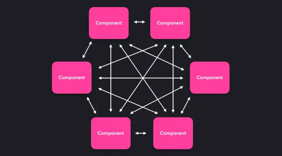

# Overview of React

A valid React component because accepts a single prop (which stands for properties) object argument with data and returns a React element

Extracting components seems like a tedious job, but having reusable
components makes things easier when coding for larger apps. A good
criterion to consider when simplifying components is this: if a part of your UI is
used several times (Button, Panel, Avatar), or is complex enough on its own
(App, FeedStory, Comment), it is a good candidate to be extracted to a
separate component.

`props` are variables passed to a component by its parent component

`State` on the other hand is still variables, but directly initialized and managed by the component.


`Redux` is a popular state management system that implements a centralized state machine driven by actions


`Component lifecycle`

mounting - rendering - dismounting

`render()`  This method is the only required method within a class component
in React and is the most used. As the name suggests, it handles the rendering
of your component to the UI, and it happens during the mounting and
rendering of your component.

When the component is created or removed:

• `componentDidMount()` runs after the component output has been
rendered to the DOM.
• `componentWillUnmount()` is invoked immediately before a
component is unmounted and destroyed

When the props or states get updated:
• `shouldComponentUpdate()` is invoked before rendering when new
props or state are being received.
• `componentDidUpdate()` is invoked immediately after updating
occurs. This method is not called for the initial render.

`High-order components (HOC)` is a function that takes a component and returns a new component

`Context`  provides a way to share these types of data between components without having to explicitly pass a prop through every level of hierarchy.

`Hooks`  functions that let you "hook into" React state and lifecycle features
from functional components.

# Design Patterns

## Singleton

`Singleton` are classes that only can be instantiated once and accessed globally.

example code:

```jsx
let instance;
let counter = 0;

class Counter() {
	constructor() {
		if (instance) {
			throw new Error("You can only create one instance!");
		}
		instance = this;
	}

	getInstace() { return this; }

	getCount() { return counter; }

	increment() { return ++counter; }

	decrement() { return --counter; }
}

const singletonCounter = Object.freeze(new Counter);

export default singletonCounter;

```

`Object.freeze` method makes sure that consuming code cannot modify the Singleton.

Singletons are actually considered an anti-pattern and should be avoided in JavaScript

Regular object in JS, as a simpler approach

```jsx
let count = 0;

const Counter = {
	increment() { return ++count; },
	decrement() { return --count; }
};

Object.freeze(counter);
export { counter };
```

We rely on global state through state management tools as `Redux` or `React Context` instead of using Singletons.

## Proxy pattern

With a `Proxy` object, we can determine behavior whenever we interact with an object. You’ll interact with the Proxy object instead of interacting with the target object directly.

person object:

```jsx
const person = {
	name: "John",
	age: 42,
	nationality: "American"
};
```

proxy instance:

- with `get` and `set` methods invoked when trying to access or modify a property.
- useful to add validation
- `Reflect` object methods have the same name and arguments as the methods on the handler object
- It's best to not use proxies for performance-critical code, since each handler method invocation can easily affect the performance.

```jsx
const personProxy = new Proxy(person, {

	get: (obj, prop) => {
	if (!obj[prop]) {
		console.log(`This property doesn't seem to exist`);
	} else {
		console.log(`The value of ${prop} is ${obj[prop]}`);
	},

	set: (obj, prop, value) => {
		console.log(`Changed ${prop} from ${obj[prop]} to ${value}`);
		return Reflect.set(obj, prop, value)
		// does -> return obj[prop] = value;
	}

);
```

## Provider pattern

Make data available to multiple child components.

If we pass data through child components through props we might end up with `prop drilling` , case when we pass props far down the component tree, this is quite messy and becomes difficult to maintain.

Instead of this we can wrap all components in a `Provider` , a high order component provided by the `Context` object (created with `createContext` from react) that has a value prop which contains the data that we want to pass down.

We can access and write data on wrapped components by calling `useContext` .

A common use case is to share a theme UI state with many components (dark/light mode)

Instead of retrieving the whole Context and wrapping all the components we could create a HOC to use an specific context (ex: `ThemeContext`) inside the big `Context` with the data that we need

```jsx
function useThemeContext() {
	const theme = useContext(ThemeContext);
	return theme;
}
```

call it from the component:

```jsx
export default function ListItem() {
	const theme = useThemeContext();

	return <li style={theme.theme>...</li>;
}
```

## Prototype pattern

Share properties among many objects of the same type

Prototype is an object that’s native to JS, and can be accessed by objects through the prototype chain.

We can see the prototype directly through accessing the prototype property on a constructor (object.prototype) or the `__proto__` property (object.__proto__) on any instance.

Similar to inheritance but always using static attributes.

## Container/Presentational pattern

Enforce separation of concerns by separating the view from the application logic

Presentational components, care about how data is shown to the user (rendering), receives its data through props and just displays it

Container components, care about what data is show to the user (fetch), main function is to pass data to presentational components

In many cases this pattern is replaced with React Hooks. Instead of having a container component to fetch the data we can create a custom hook that does the fetch and return the results.

This pattern encourages the separation of concerns, presentational components are reusable and easier to test but it may be an overkill in smaller sized application.

## Observer pattern

Uses observables to notify subscribers when an event occurs

Useful when working with asynchronous, event-based data, to maybe notify components whenever certain data has finished downloading or whenever users sent new messages

notify all other members.

Pros

Enforces separation of concerns an single-responsibility principle.

Observer objects aren’t tightly coupled to the observable object and can be decoupled at any time

Observable object responsible for monitoring events

Observers simply handle the received data

Cons

If the observer is too complex it may cause performance issues when notifying all subscribers

`RxJS` is a popular library that uses this pattern combined with the iterator pattern and functional programming with collections to manage sequences of events.

## Module Pattern

Split up your code into smaller, reusable pieces.

With this pattern we can encapsulate parts of our code that should be private, preventing accidental name collision and global scope pollution

```jsx
// import all default exports from a module
import * from “module”;

// aliases an import
import {fun as f} from "module"

// dynamic import (reduces page load time)
button.addEventListener("click", () => {
	import("./math.js").then((module) => {
		console.log("Add: ", module.add(1, 2));
	})
});
```

## Mixin pattern

Add functionality to objects or classes without inheritance

A mixin is an object that we can use to add reusable functionality to another object or class without inheritance.

```jsx
class Dog {
	constructor(name) {
		this.name;
	}
}

const dogFunctionaliity = {
	bark: () => console.log("Woof!");
	play: () => console.log("Woof Woof!");
};

Object.assign(Dog.prototype, dogFunctionality);
```

The React team discourages the use of mixins as it adds unnecessary complexity to a component, they encourage the use of higher order components which can now often be replaced by hooks.

Mixins modify the object prototype, this is seen as a bad practice.

## Mediator/Middleware pattern

Use a central mediator objet to handle communication between components

A good example is a chatroom, users within a chatroom won’t talk to each other directly the chatroom servers as the mediator between the users.

It simplifies many-to-many relationships by letting all communication flow through one central point.




Case study

Express.js is a popular web app server framework, we can add callbacks to certain routes that the user can access.

For example if we want to add a header to the request if the user hits the root (/), we can add it in a middleware callback. So we create a chain of middleware functions that sit between the req and resp.

## Render Props pattern

Pass JSX elements to components through props

By using render props, you can encapsulate logic that can be reused across different components without altering the components themselves.

On a component the render prop value is a function that returns a JSX element, the component itself does not render anything besides the render prop, it just simply calls the render prop instead of implementing its own rendering logic

```jsx
<Title render={() => <h1>I am a render prop!</h1>} />
```

In some cases we can replace render props with hooks, which solves a lot of cases that required render props

## Hooks pattern

Use functions to reuse stateful logic among multiple components throughout the app

They are not necessarily a design pattern but play a very important role in app design, many patterns can be replaced by hooks.

Hooks:

- add state to a functional component
- manage a component's lifecycle without having to use lifecycle methods
such as componentDidMount and componentWillUnmount
- reuse the same stateful logic among multiple components throughout the
app

With `useState` we could manage state by passing an argument, the initial value of the state and it returns a list with the state and the setter function for that state.

`useEffect` combines componentDidMount, componentDidUpdate and componentWillUnmount lifecycle methods. We could pass variables to the dependency array (second argument) so when that value is updated it will execute the callback

`useContext` returns the current context value for that context.

Any component calling useContext always re-render whenever the context value changes

`useReducer` it takes a reducer function and an initial state and returns the current state a dispatch function as output

## HOC pattern

Pass reusable logic down as props to components throughout your application

A Higher Order Component (HOC) receives another component and contains certain logic that we want to apply to it, after applying that logic it returns the element with the additional logic.

In some cases it could be replaced by hooks:

**Best use-cases for a HOC:**

- The same, uncustomized behavior needs to be used by many components
throughout the application.
- The component can work standalone, without the added custom logic.

**Best use-cases for Hooks:**

- The behavior has to be customized for each component that uses it.
- The behavior is not spread throughout the application, only one or a few
components use the behavior.
- The behavior adds many properties to the component

## Flyweight pattern

Reuse existing instances when working with identical objects

Good way to conserve memory when creating large number of similar objects

In JavaScript, we can easily solve this problem through prototypal inheritance.

Nowadays, hardware has GBs of RAM, which makes the flyweight pattern
less important.

## Factory pattern

Use a factory function in order to create objects

A function is a factory when it returns a new object without the use of the new keyword, it can be useful if creating complex and configurable objects depending on the current environment or user-specific configuration, etc.

example:

```jsx
const createUser = ({firstName, lastName, email}) => ({
	firstName,
	lastName,
	email,
	fullName() {
		return `${this.firstName} ${this.lastName}`;
	}
});

const user = createUser("John", "Doe", "johndoe@somecompany.com")

// instead of

class User {
	constructor (firstName, lastName, email) {
		this.firstName = firstName;
		this.lastName = lastName;
		this.email = email;
	}

	fullName() {
		return `${this.firstName} ${this.lastName}`;
	}
}

const user = new User({
	firstName: "John",
	lastName: "Doe",
	email: "johndoe@somecompany.com"
});
```

## Compound pattern

Create multiple components that work together to perform a single task

**Parent Component**: Manages shared state and behavior.

**Child Components**: Render specific UI elements and access shared data via context.

example

- **`Toggle`**: Parent that manages state.
- **`ToggleButton`**: Child that triggers state changes.
- **`ToggleContent`**: Child that conditionally renders based on state.

It has:

- **Clear Structure**: Groups related components.
- **Reusability**: Components can be reused in various contexts.
- **Encapsulation**: Logic remains in the parent, simplifying children.
- **Complexity**: Managing context can be complex.
- **Boilerplate**: Requires additional setup but improves clarity.

## Command pattern

Decouple methods that execute tasks by sending commands to a commander

example:

```jsx
// without command

class OrderManager() {
	constructor() {
		this.orders = []
	}

	placeOrder(order, id) {
		this.orders.push(id)
		return `Sucessfully ordered ${order} (${id})`
	}

	cancelOrder(id) {
		this.orders = this.orders.filter(order => order.id !== id);
		return `Canceled ordered ${id}`
	}
}

const manager = new OrderManager();

manager.placeOrder("Pizza", "1234");
manager.cancelOrder("1234");

// with command

class ORdeManager {
	constructor() {
		this.orders = [];
	}

	execute(command, ...args) {
		return command.execute(this.orders, ...args);
	}
}

class Command {
	constructor(execute) {
		this.execute = execute;
	}
}

function PlaceOrderCommand(order, id) {
	return new Command(orders => {
		orders.push(id);
		return `Sucessfully ordered ${order} (${id})`
	});
}

function CancelOrderCommandid) {
	return new Command(orders => {
		orders = orders.filter(order => order.id !== id);
		return `Canceled ordered ${id}`
	});
}

const manager = new OrderManager();
manager.execute(new PlaceOrderCommand("Pizza", "1234");
manager.execute(new CancelOrderCommand("1234");
```

The command pattern allows us to decouple methods from the object that
executes the operation. It gives you more control if you're dealing with
commands that have a certain lifespan, or commands that should be queued
and executed at specific times.

Use cases are limited and often adds unnecessary boilerplate to an app.

# Rendering

Chrome encourages static rendering or server-side rendering over full rehydration approach.

Rendering Performance Indicators


Depending on the type of the application or the page type, some patterns are more suitable than others for example:


## Overview of Next.js

**Features**

- Pre-rendering, generating the html for each page in advance and not on the client-side. Ensuring the js code required to make the page fully interactive gets associated with the generated html, js code runs once the page loads at this point React works in a shadow dom to ensure that the rendered code matches what React would render without actually manipulating it, this process is called `Hydration`

**Data Fetching**

- Next.js supports data fetching with both SSR and static generation
    - `getStaticProps` Used with Static generation to render data
    - `getStaticPaths` Used with Static generation to render dynamic routes
    - `getServerSideProps` Applicable to SSR

**Static File Serving**

For example images can be served under the `public` folder, same image may be referenced multiple times using the root.

**Automatic Image Optimization**

Allows resizing, optimizing and serving images in modern formats. With the `Image` Next.js component which is an extension of ``

**Routing**

Routing through the `pages` directory and dynamic routes using named parameters where the actual document displayed is determined by the value of the parameter.

**Code Splitting**

Ensures that only the required js is sent to the client to improve performance.

Next.js supports two types:

- **Route-based**: implemented by default, when a user visits a route Next.js only sends the code for the initial router. The other chunk are downloaded as required when the user navigates around, this limits the amount of code that needs to be parsed and compiled at once, improving the page load times
- **Component-based**: allows splitting large components into separate chunks that can be lazy-loaded when required. Next.js supports component-based code splitting through dynamic import().

## Client Side Rendering (CSR)

The server only renders the barebones HTML container for a page.

Logic, data fetching, templating and routing required to display content is handled by js code executed in the browser/client.

It is a popular method of building SPAs, it blurs the diff between websites and installed apps.

- Seo considerations
- Performance
- Code Maintainability
- Data Fetching

**Improving CSR performance**

- Budgeting JavaScript: tight js budget for the initial page load, code loaded on-demand as features are needed
- Preloading: critical resources may include js which can be preloaded by including this directive in the head section of the html

    ```jsx
    <link rel="preload" as="script" href="critical.js">
    ```

    to start loading critical.js before the page rendering mechanism starts so the script will be available earlier.

- Lazy loading: to only load resources at the time they’re needed.
- Code splitting: the avoid a large bundle of js code. Supported by bundlers like webpack where it can be used to create multiple bundles that can be dynamically loaded at runtime, this allows to lazy load js resources
- Application shell caching with service workers: caching the app shell which is the minimal html, css and js powering a ui. Service workers can be used to cache the app shell offline, useful in providing a native spa experience where the remaining content is loaded progressively as needed

## Server Side Rendering (SSR)

Generate HTML to be rendered on the server in response to a user request

Done in Next.js with `getServerSideProps`

Less js leads to quicker FCP and TTI

Additional budget for client-side js

Better SEO

Slow TTFB

Full page reloads required for some interactions

We will see variations of Server Side Rendering for having

- Interactivity comparable to Client-Side Rendered (CSR) applications
- SEO benefits that are comparable to SSR applications.

## Static Rendering (SSG)

Deliver pre-rendered HTML content but that was generated when the site was built.

Ideal for static pages, about us, contact us, blog pages, product pages for e-commerce apps.

Static rendering or static generation (SSG) attempts.

**SSG with Data**

Imagine the content for individual blog or product pages, data from the db has to be merged with an specific template and then rendered to HTML at build time.

Number of HTML pages generated depend on the number of blogs or products. With Next.js static rendering we can generate listing or individual item pages on the available items. By using `getStaticProps` and `getStaticPaths`


Performance and SEO make SSG a great rendering pattern, but for using this pattern you have to consider some cases:

- Large number of HTML files: long build time
- Hosting Dependency: hosting platform used to store and serve static content should be good (solution CDNs)
- Dynamic Content: unsuitable to highly dynamic content because it has to build/deploy for every change.

## Incremental Static Generation

Update static content after you have built your site

iSSG pattern was introduced as an upgrade to SSG, to solve the dynamic data problem and help static site scale for large amounts of frequently changing data. It allows to update existing pages and add new ones by pre-rendering a subset of pages in the background even while fresh req for pages are coming in

**Adding new pages**

It uses the lazy loading concept to include new pages on the website after the build.

By using returning `fallback: true` prop on `getStaticPaths` , means that the missing pages will not 404 and instead can render a fallback version of the page (meanwhile Next.js will generarte the page in the background)

**Updating Existing pages**

We can add a `revalidate: seconds` for setting a ttl to a page on `getStaticProps` for Next.js to know when it has to revalidate and update it.

iSSG advantages

- Dynamic data
- Speed
- Availability
- Consistency (load on db and back is low and consistent performance without lag spikes)
- Ease of Distribution: (CDNs)

## Progressive Hydration

Delay loading JS for less important parts of the page

Although SSr provides a faster FCP it doesn’t provide a faster TTI, necessary js for users to interact hasn’t been loading, it may look interactive but is not yet. This process is called `hydration`, React checks the current DOM nodes and hydrates the nodes with the corresponding js. UI seems frozen. Progressive hydration makes it possible to only request the minimum necessary js to avoid this problem


Requirements for a holistic progressive hydration:

- Allows usage of SSR for all components.
- Supports splitting of code into individual components or chunks.
- Supports client side hydration of these chunks in a developer defined
sequence.
- Does not block user input on chunks that are already hydrated.
- Allows usage of some sort of a loading indicator for chunks with deferred
hydration.

`pool-attendant-preact` is a library that includes an API called `withHydration` which lets you mark more interactive components for hydration, this will be hydrated first, you can use this to define your page content as follows

```jsx
import Teaser from "./teaser";
import { withHydration } from "next-super-performance";

const HydratedTeaser = withHydration(Teaser);

export default function Body() {
	return (
		<main>
			<Teaser column{1} />
			<HydratedTeaser column={2} />
			<HydratedTeaser column={2} />

			<Teaser column{1} />
			<Teaser column{2} />
			<Teaser column{3} />

			<Teaser column{1} />
			<Teaser column{2} />
			<Teaser column{3} />
		</main>
	);
}

```

Advantages:

- Promotes code-splitting
- Allows on-demand loading for infrequently used parts of the page
- Reduces bundle size

Although it may not be suitable for dynamic apps where every element on the screen is available to the user and needs to be made interactive on load.

## Streaming Server-Side Rendering

Generate HTML to be rendered on the server in response to a user request

Streaming is another rendering mechanism that can be used to improve SSR performance, it implies that chunks (smaller parts for example per component → component-based chunking) of HTML are streamed from the node server to the client as they are generated

- Performance improvement
- Handling of Backpressure, streaming responds well to network congestion and can result in responsive webs on challenging conditions
- Supports SEO

## React Server Components

Server Components compliment SSR, rendering to an intermediate abstraction without needing to add the JS bundle

- Code for Server Components is never delivered to the client. In many
implementations of SSR using React, component code gets sent to the
client via JavaScript bundles anyway. This can delay interactivity.
- Server components enable access to the back-end from anywhere in
the tree. When using Next.js, you're used to accessing the back-end via
getServerProps() which has the limitation of only working at the toplevel page. Random npm components are unable to do this.
- Server Components may be refetched while maintaining Client-side
state inside of the tree. This is because the main transport mechanism is
much richer than just HTML, allowing the refetching of a server-rendered
part (e.g such as a search result list) without blowing away state inside (e.g
search input text, focus, text selection)

Some of the early integration work for Server Components will be done via a
webpack plugin which:
• Locates all Client components
• Creates a mapping between IDs => chunk URLs
• A Node.js loader replaces imports to Client components with references to
this map.
• Some of this work will require deeper integrations (e.g with pieces such as
Routing) which is why getting this to work with a framework like Next.js will
be valuable.

## Selective Hydration

How to use combine streaming server-side rendering with a new approach to hydration, selective hydration

Streaming rendering allows you to start streaming components as soon as
they're ready, without risking a slower FCP and TTI due to components that
might take longer to generate on the server.

Components can be hydrated as soon as they're streamed to the client, since
we no longer have to wait for all JavaScript to load to start hydrating and can
start interacting with the app before all components have been hydrated.

## Islands Architecture

The islands architecture encourages small, focused chunks of interactivity within server-rendered web pages.

It describes a paradigm that aims to reduce the volume of js shipped through “islands” of interactivity that can be independent delivered on top of otherwise static HTML.

It is a component-based architecture, with a compartmentalized view of the page with static and dynamic islands.

Static regions pure non-interactive html and don’t need hydration

Dynamic regions are a combination of html and js capable of rehydrating themselves after rendering


# Performance

## Optimize your loading sequence


- Prioritize critical CSS, fonts, and above-the-fold (ABT) images for faster FCP and LCP.
- Lazy load below-the-fold (BTF) images and non-essential scripts.
- Efficiently sequence JavaScript, splitting large chunks and utilizing async/defer attributes.
- Reduce dead or unused code and optimize resource loading for improved user experience and Core Web Vitals.

### PRPL Pattern

Optimize initial load through precaching, lazy loading, and minimizing roundtrips

The PRPL pattern focuses on four main performance considerations:

• Pushing critical resources efficiently, which minimizes the amount of
roundtrips to the server and reducing the loading time.
• Rendering the initial route soon as possible to improve the user experience
• Pre-caching assets in the background for frequently visited routes to
minimize the amount of requests to the server and enable a better offline
experience
• Lazily loading routes or assets that aren’t requested as frequently

`Import`: Static - Dynamic - On Visibility - On Interaction

`Route Based Splitting` Dynamically load components based on the current route

`Bundle Splitting` Split your code into small, reusable pieces

`Tree Shaking` Reduce the bundle size by eliminating dead code

`Preload` Inform the browser of critical resources before they are discovered

`Prefetch` Fetch and cache resources that may be requested some time soon

`List Virtualization` Optimize list performance with list virtualization (windowing), not the same as pagination. Virtualization only renders visible items dynamically as the user scrolls, whereas pagination loads a fixed number of items per page.