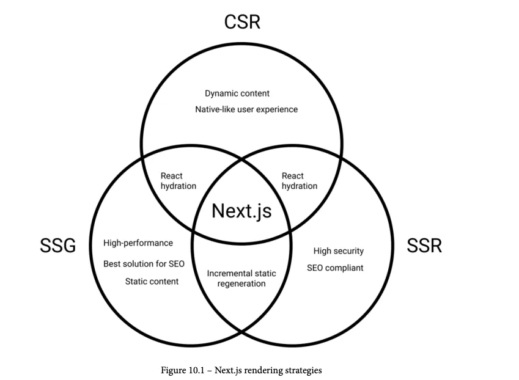

# Real-World Next.js

The most significant difference between React and Next.js is that while React is just
a JavaScript library, Next.js is a framework for building rich and complete user
experiences both on the client and server sides, adding tons of incredibly useful features.


### Different Rendering Strategies

**Server Side Rendering**:

- `More secure web apps`: Rendering a page on the server side means that activities
such as managing cookies, calling private APIs, and data validation happen on the
server, so we will never expose private data to the client.

- `More compatible websites`: The website will be available even if the user has
disabled JavaScript or uses an older browser

- `Enhanced search engine optimization`: Since the client will receive the HTML
content as soon as the server renders and sends it, the search engine spiders
(bots that crawl the web pages) will not need to wait for the page to be rendered
on the client side. This will improve your web app's SEO score.

For making a REST API call on the server side for each request:

- We start by exporting an async function called `getServerSideProps`. During
the build phase, Next.js will look for every page exporting this function and make
them dynamically server-side rendered for each request. All the code written within
this function scope will always be executed on the server side.
- Inside the getServerSideProps function, we return an object containing a
property called props. This is required because **Next.js will inject those props
inside our page component**, making them available both on the client and server
side.

```javascript
export async function getServerSideProps() {
  const userRequest = await fetch("https://example.com/api/user");
  const userData = await userRequest.json();
  return {
    props: {
      user: userData,
    },
  };
}

function IndexPage(props) {
  return <div>Welcome, {props.user.name}!</div>;
}

export default IndexPage;
```

**Client Side Rendering:**

- `It makes your app feel like a native app`: Downloading the whole JavaScript bundle
means that you already have every page of your web app downloaded in your
browser. If you want to navigate to a different page, it will swap the page content
instead of downloading new content from the server. You don't need to refresh the
page to update its content.

- `Page transitions made easy`: Client-side navigation allows us to switch from one
page to another without reloading the browser window. This comes in handy when
you want to show some cool transitions between pages with ease because you don't
have any reload that might interrupt your animations.

- `Lazy loading and performances`: With CSR, the browser will only render
the minimum HTML markup required for the web app to work. If you have
a modal that appears once the user clicks on a button, its HTML markup is not
present on the HTML page. It will be created dynamically by React once the
button click event occurs.

- `Less server-side workload`: Given that the whole rendering phase is delegated to
the browser, the server only needs to send a very basic HTML page to the client.
You then don't need a very powerful server; indeed, there are cases where you can
host your web app on **serverless** environments, such as AWS Lambda, Firebase,
and so on.

`useEffect` let you perform side effects inside function components, and it will do it after the component has been mounted so it will run on the browser after React hydratation, letting you preform certain actions only on the client side.

We can combine `useEffect` and `useState` for rendering a component exclusively on the client side:

```javascript
import { useEffect, useState } from "react";
import Highlight from "../components/Highlight";

function UseEffectPage() {
  const [isClient, setIsClient] = useState(false);
  useEffect(() => {
    setIsClient(true);
  }, []);
  return (
    <div>
      {isClient && (
        <Highlight code={"console.log('Hello, world!')"} language="js" />
      )}
    </div>
  );
}

export default UseEffectPage;
```

**Static Site Generation**

With SSG, we will be able to pre-render some specific pages (or even the whole website if
necessary) at build time

- `Easy to scale`: Static pages are just HTML files that can be served and cached easily
by any content delivery network (from now on, CDN). But even if you want to
serve them using your own web server, it will result in a very low workload, given
that no hard computations are needed for serving a static asset.

- `Outstanding performances`: As said before, the HTML is pre-rendered at build
time, so both the client and server can bypass the runtime rendering phase for each
request. The web server will send the static file and the browser will just display it,
as easy as that. No data fetching is required on the server side; everything we need is
already pre-rendered inside the static HTML markup, and that reduces the potential
latency for each request.

- `More secure requests`: We don't need to send any sensitive data to the web server
for rendering the page, and that makes life a bit harder for malicious users. No
access to APIs, databases, or other private information is required because every
piece of information needed is already part of the pre-rendered page.

SSG is probably one of the best solutions for building performant and highly scalable
frontend applications. The biggest concern about this rendering technique is that once the
page has been built, the content will remain the same until the next deployment.

Thanks to `Incremental Static Regeneration (ISR)` we can specify at the page level how long Next.js should wait before re-rendering a static page updating its content.

Let's pretend we've built a very complex dashboard that can handle a lot of data… but the
REST API request for this data is taking up to a few seconds to succeed. In that case, we
are lucky because that data won't change a lot during this time, so we can cache it for up
to 10 minutes (600 seconds) using SSG and ISR:

```javascript
import fetch from "isomorphic-unfetch";
import Dashboard from "./components/Dashboard";

export async function getStaticProps() {
  const userReq = await fetch("/api/user");
  const userData = await userReq.json();
  const dashboardReq = await fetch("/api/dashboard");
  const dashboardData = await dashboardReq.json();

  return {
    props: {
      user: userData,
      data: dashboardData,
    },
    revalidate: 600, // time in seconds (10 minutes)
  };
}

function IndexPage(props) {
  return (
    <div>
      <Dashboard user={props.user} data={props.data} />
    </div>
  );
}

export default IndexPage;
```

1. Next.js fills the page with the results of getStaticProps at build time, statically
generating the page during the build process.

2. In the first 10 minutes, every user will access the exact same static page.

3. After 10 minutes, if a new request occurs, Next.js will server-side render that page,
re-execute the getStaticProps function, save and cache the newly rendered
page as a static asset, overriding the previous one created at build time.

4. Every new request, within the next 10 minutes, will be served with that new
statically generated page.

Static-site generation is a great way to create fast and secure web pages, but sometimes we might want to have more dynamic content.

Thanks to Next.js, we can always decide which page should be rendered at build time (SSG) or request time (SSR). We can take the best of both approaches by using SSG + ISR, making our pages a "hybrid" between SSR and SSG, and that's a game-changer for modern web development.

## Next.js basics and components

**Routing and navigation**

A default Next.js project ships with a `pages/` directory. Every file inside that folder represents a new page/route for your application.
Therefore, when talking about a page, we refer to a React component exported from any of
the .js, .jsx, .ts, or .tsx files inside the pages/ folder.

**Using route variables `pages/greet/[name].tsx`**

```jsx
export async function getServerSideProps({
  params,
}: {
  params: { name: string };
}) {
  const { name } = params as { name: string };

  return {
    props: {
      name,
    },
  };
}

function Greet({ name }: { name: string }) {
  return <h1> Hello, {name}! </h1>;
}

export default Greet;
```

**Using route variables inside components, with `useRouter`**

```jsx
import { useRouter } from 'next/router';

function Greet() {
 const { query } = useRouter();
 return <h1>Hello {query.name}!</h1>;
}

export default Greet;
```

Use the `Link` component for navigating between different routes, by default nextjs preloads every single Link found on the viewport (can change it with preload={false})

Another way is using the `useRouter` hook, since it returns a router object and we can use the router.push method inside to redirect users.

**Automatic image optimization** is done by the `Image` component.

Adding the `loader` option on the `next.config.js` file enables automatic image optimization on external services, Vercel take cares of this if deploying there. Otherwise you can use this external services: Akamai, Imgix or Cloudinary

You can set the loader option inside the Image component for custom image optimization

```jsx
import Image from "next/image";
const loader = ({ src, width, quality }) => {
  return `https://example.com/${src}?w=${width}&q=${quality || 75}`;
};
function CustomImage() {
  return (
    <Image
      loader={loader}
      src="/myimage.png"
      alt="My image alt text"
      width={350}
      height={540}
    />
  );
}
```

Imgproxy or Thumbor are free open source projects for this purpose.

`Head` components allows to dinamically update the head section of our page, for example to update our page title

```jsx
<Head>
  <title> Welcome to my Next.js website </title>
</Head>
```

By customizing `_app.js` we can render common components on all pages. For example the navbar.

```jsx
import Navbar from "../components/Navbar";

function MyApp({ Component, pageProps }) {
  return (
    <>
      <Navbar />
      <Component {...pageProps} />
    </>
  );
}

export default MyApp;

```

`_document.js` serves a similar purpose by defining <head> <html> and <body> tags with the the `Head`, `Html` ,`Body` and `NextScript` (inserts required scripts) components.

## Organizing the code

**Organizing components: atomic design principle**

`atoms` basic components, like button, input and p, also animations, color palettes, etc.

`molecules` small group of atoms combined with a minimum utility, like input and label atom

`organisms`  molecules and atoms combined, like form, footer, carousel

`templates` skeleton of a page, where we put organisms, molecules and atoms together to create the final page that the user will browse

**lib files**

scripts that wrap third-party libraries as lib files, for example initializing GraphQL client, some queries and mutations, etc.

**Data fetching**

server-side: data fetching could happen at build time (`getStaticProps`) or at runtime (`getServerSideProps`)

It is recommended to build the connection to the database on another service built with an specialized backend framework

- Fetching on the server side

  Given that nodejs doesn't support fetch, we have two options:

  - Using the nodejs built in https library
  - Using HTTP client libraries, for example isomorphic-unfetch (renders the js fetch), undici (official nodejs http 1.1 client) and axios (runs on both client and server)

- Fetching on the client side

  - Only to trusted sources
  - Only call HTTP APIs with an SSL certificate
  - Never connect to a remote database

  We usually want our client-side requests to run in two cases:

  - Right after the component has mounted
  - After a particular event occurs

`CORS` → Cross-Origin Resource Sharing, security mechanism implemented by browsers that aims to control requests made from domain different from those of the API domain

## Managing state

Managing **local state** with the `useState` hook is an excellent way on cases that include:

- atom components: to manage little local states
- loading states: when fetching data we have a moment when we’re waiting, we can handle that by setting a loading state to true until the fetch request is completed to display a nice loading spinner.

**Global state** management

- Libraries: Redux, Recoil and MobX
- Context APIs
- Apollo Client (in-memory cache)

## CSS and Built-In Styling Methods

**Styled JX**

CSS-in-JS library, that allows to write css rules and classes scoped to a specific component

```javascript
// with class name
export default function FancyButton(props) {
  return (
  <>
  <button className="button">{props.children}</button>
  <style jsx>{`
    .button {
      padding: 2em;
      border-radius: 2em;
      background: purple;
      color: white;
      font-size: bold;
      border: pink solid 2px;
    }
 `}</style>
 </>
 );
}

// without class name
export default function Highlight(props) {
  return (
  <>
  <span>{props.text}</span>
  <style jsx>{`
    span {
      background: yellow;
      font-weight: bold;
    }
  `}</style>
  </>
  );
 }
```

you can also define global styles with `jsx global` to apply styles to all the html elements matching the selector

```javascript
export default function Highlight(props) {
  return (
  <>
  <span>{props.text}</span>
  <style jsx global>{`
    span {
      background: yellow;
      font-weight: bold;
    }
 `}</style>
 </>
 )
}
```

**CSS modules**

This approach has a better performance overall, because it doesn’t need to re-generate css rules after react hydration on the client side, also it doesn’t need to transform js styles into css at runtime or compile time.

Styles are also component scoped, it generates an unique class for each component

Example: for the home component we can create a `Home.module.css` including its styles

We can also create global css rules by adding the :global keyword or editing the global.css styles

`.button :global {`

Another feature is the **selector composition**

by creating a generic rules for example for button, and other rules for another specific button class but using the generic button rules (similar to inheritance)

```css
.button-default {
	 padding: 5px;
	 border: none;
	 border-radius: 5px;
	 background-color: grey;
	 color: black;
}

.button-success {
	 composes: button-default;
	 background-color: green;
	 color: white;
}
```

nextjs compiles css modules using **PostCSS**, configured by default with the following features:

- Autoprefixer: vendor prefixes to your CSS rules, to make rules compatible with all browsers
- Cross-browser flexbox bug fixes
- IE11 compatibility: compiles new css features, making them available on older browsers

**Integrating SASS with Next.js**

```shell
npm i sass
```

With Sassy CSS the CSS syntax is extended with loops, variables, mixins and other features.

It doesn’t use curly brackets or semicolons, just uses indentation and new lines to separate properties and nested selectors, however it needs to be transpiled into vanilla CSS in order to be used.

For extending css classes we have different approaches:

```css
// @extend keyword
.button-default {
	padding: 5px;
	border: none;
	border-radius: 5px;
	background-color: grey;
	color: black;
}

.button-success {
	@extend .button-default;
	background-color: green;
	color: white;
}

// selector nesting
button {
	padding: 5px;
	border: none;
	border-radius: 5px;
	background-color: grey;
	color: black;

	&.success {
		background-color: green;
		color: white;
	}
}
```

You may need to enable/disable some specific features or edit the default SASS configuration, it can be done by editing `next.config.js`

```js
module.exports = {
 sassOptions: {
 outputStyle: 'compressed'
 // ...add any SASS configuration here
 },
}
```

## Using UI frameworks

**Chakra UI**

Accessibility, Themeable, Light and Dark mode, Composability, TypeScript support

When using the vertical stack (`VStack`) component, it uses flexbox under the
hood, to help us to arrange the child elements vertically.

By passing `as="a"` we’re telling Chakra UI to render the Button as an `<a>` html element, this way we can use the PassHref prop in its parent Link component, to pass its href value to the button, making a more accessible UI.

```html
<Button marginTop="8" as="a">
```

**Tailwind CSS**

100% framework-agnostic: you can use it for writing the frontend of any web application independently of the technology you're using.

## When testing Next.js

>[!WARNING]
> Next.js serves every .js, .jsx, .ts, and .tsx file placed inside of the
pages/ directory as an application page. Therefore, you should never place
any test file inside that directory, or Next.js will try to render it as an application
page. We will see how to test Next.js pages in the next section while writing
end-to-end tests

## Working with SEO and managing performance

SEO - Search Engine Optimization

Choosing the proper rendering method for your application (SSR, SSG, CSR):

- **Client-side rendering (CSR)**: Great performance, highly dynamic content, but
lousy SEO and security

- **Server-side rendering (SSR)**: Better SEO, excellent security, but possibly inferior
performance, and more challenging to manage the server

- **Static site generation (SSG)**: Best possible performance, best possible SEO score,
but lacking security and bad for highly dynamic content



**On private routes**

Clearly we don’t care about SEO on this ones but security.

We want to sacrifice performance to improve security.

We could quickly generate private routes statically and make the required API calls on the client side, this could expose personal/private data if not handled correctly. Instead we want to adopt the SSR strategy to detect anonymous users right before rendering anything and redirect them.

Rendering important data on the client side negatively impacts SEO score

There are specific SEO metrics that might be out of our control when developing the web. Domain authority, referring domains, page impressions, click-through rate and organic market share, etc. Although those metrics are the product of good content management on the website, we should do our best to improve whatever we can by coding.

**Optimizations and developments to improve SEO:**

- **Creating an SEO-friendly routing structure:** a well-made routing system is essential for search engine boots to index a website correctly. Human friendly URLS and composed according certain logic. For example for creating a blog we should use a URL structure to help the user identify the page content by just looking at the URL
    - https://myblog.com/posts/1 good to work with but harder for users
    - https://myblog.com/posts/how-to-deal-with-seo better url

- Fill the pages with **correct and complete metadata**: essential data that we should always include, we have the `next-seo` library for this purpose, that can reduce the development time required to manage metadata.

- **Optimize images**: `Image` component

- Generate a proper **sitemap (**`sitemap.xml`**)**: once ready to deploy we can submit the sitemap to search engines to help them index our content. A well-made one is essential for any website, as it allows the creation of a neat, structured path for search engines to follow to index the site. There is no built-in solution for this, but we have libraries including `nextjs-sitemap-generator` (visit https://sitemaps.org/)

- Use the **correct HTML tags**: using semantic html tags to build the website is essential, they tell engine bots how to index the content in terms of priority and importance. Example: we always want our content to be indexed by `<h1>` tags  for every text content is not the best choice, we need to find the right balance in order for our html tags to be meaningful for users and search engine bots.

- Another crucial metric is the **performance**
  Not only the server side but even the frontend performance.

  With Vercel we can collect valuable info about performance:

  - Largest contentful paint (LCP): loading performance < 2.5 s initial page load
  - First input delay (FID): how much time it takes for the page to be interactive < 100 ms
  - Cumulative layout shift (CLS): visual stability, a heavy picture that takes long time to load once it appears it could shift the layout, other elements could do the same thing (banners, third party widgets, etc)

  If you don’t want to deploy on vercel you could still collect this data: On `_app.js`

  ```js
  export const reportWebVitals = (metrics) => console.log(metrics);

  export default function MyApp({ Component, pageProps }) {
  return <Component {...pageProps} />;
  }
  ```
  then we can export this metrics to external services as google analytics or plausible

  ```js
  export const reportWebVitals = (metrics) => sendToGoogleAnalytics(metric);
  ```

## Different Deployment Platforms

Vercel is built for static sites and frontend frameworks. It supports server-side-rendered pages by serving them via `serverless` functions: single function that gets invoked on a managed infrastructure, we write the function without thinking about the server executing it, unlike traditional servers we pay a fraction of a cent for each function execution, depending on the execution duration, memory usage and other metrics. AWS Lambda (most popular serverless env) costs $0.20 for every million requests. Netlify is a good alternative to Vercel.

**Deploying a static site to a CDN (Content Delivery Network)**

If the datacenter where we deploy our page is far from one place it will have more latency leading to bad performance.

CDNs solve this problems by providing infrastructure in almost every continent, if you deploy a static asset to a CDN it will be replicated across al the regions in the network making it available closer to all users.

Alternatives are: Amazon AWS, Microsoft Azure CDN and Cloudflare.

There is a library called `serverless-nextjs` that let us deploy a website in a completely serverless fashion

**Using a Custom Server**

Common cases for using a custom server:

- Integrating Next.js into an exsiting server
- Multi-tenancy
- You want more control (on the backend code, for ex: by adopting the mvc philosophy where nextjs is just the view)

There are downsides for example: you cant deploy a custom server to some providers as Vercel or Netlify and you’ll need to write and mantain more code.

For deploying on a custom server we need:

- Node.js runtime
- A process manager, for example PM2, since nodejs has a single-threaded arch if its main process crashes the whole application will stay down.
- A reverse proxy, like NGINX, Caddy or Envoy, to add an extra layer of security.
- Setting up firewall rules, open the firewall to accept incoming http requests to the :443 and :80 ports
- Setting up an efficient deployment pipeline, with Jenkins, CircleCI or GitHub Actions.

**Running Next.js in a Docker container**

dockerfile
```dockerfile
FROM node:18-alpine

RUN mkdir -p /app

WORKDIR /app

COPY . /app/

RUN npm install
RUN npm run build

EXPOSE 3000

CMD npm run start
```
.dockerignore
```
.next
node_modules
```
then
```shell
docker build -t my-first-dockerized-nextjs-app .

docker run -p 3000:3000 my-first-dockerized-nextjs-app
```

## Authentication

Authentication strategies:

- Credentials-based
- Social login
- Passwordless login (magic link)
- Single sing-on (SSO), like Okta where you log in and it will redirect you to the desired website

When the lambda function terminates its execution server-side session will be lost, we use the concept of `stateless sessions` on this, instead of setting a session cookie that links a server-side session to the front, we want to release some information that identifies the user on each request. `JWT-based` (JSON Web Token) authentication follows this pattern:

---

`CMS (Content Management System)` is a platform where you can manage, create or modify content on a website without having technical knowledge. CMS facilitates website management through UI and intuitive tools to organize content. We’re using GraphCMS on our project `13-building-website` but WordPress is the most popular one.